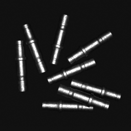
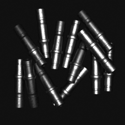
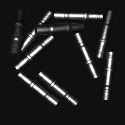
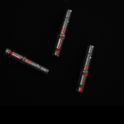
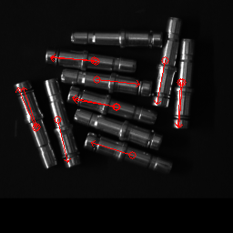
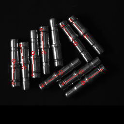
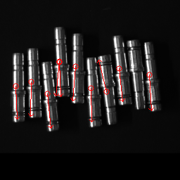
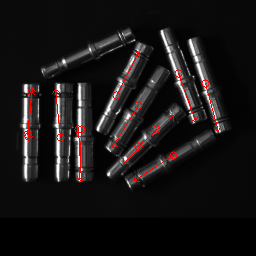
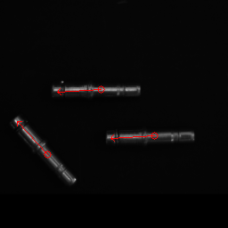

# YOLO-Object-Localization
Modified YOLO (You Only Look Once) to detect and localize objects for bin picking applications
The YOLO algorithm is the fastest detection algorithm.

For this project, YOLO was modified to detect and localize the objects in the bin-picking application. 
The network predicts key point pairs for each object.
hence, modified YOLO is able to detect position and orientation of objects, which is really helpful for the bin picking application.

# Requirements
Tensorflow 2.0

Keras

OpenCV
# Synthetic data

# Predictions

